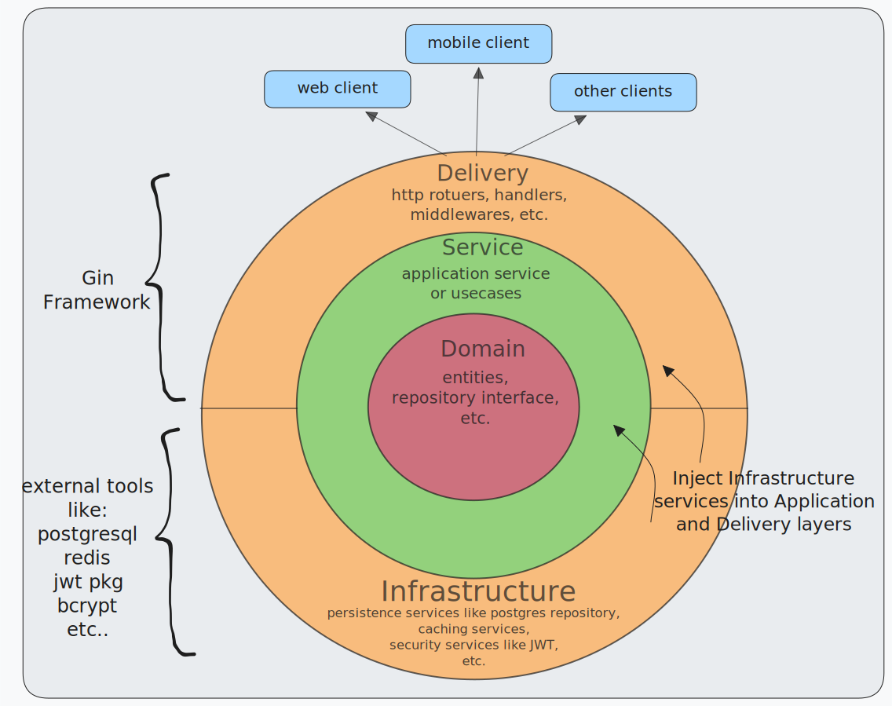
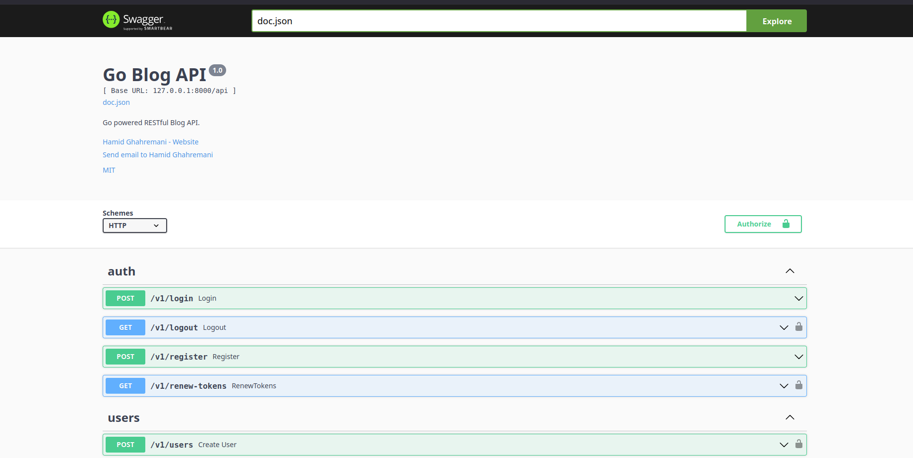

# Go Blog API

Go powered (clean architecture inspired) RESTful Blog API with crud operations, caching features, authentication and authorization mechanisms, and more. It uses Postgresql for storage, Redis for caching, Swagger for documentation, etc.

**NOTE :** project is not completed yet and some (2 or 3) of listed features is not implemented yet (actually they are not committed yet...)

## Features

- Clean architecture inspired. this project's system design follows some basics principles (not all principles) of clean architecture to improve maintainability, make testing easier, increase flexibility and reusability, etc. (check [System Architecture Diagram](#system-architecture-diagram) and [Directory Structure](#directory-structure) sections below to see more details)

- JWT based authentication (implemented [here](./internal/infra//security/jwt/) - used in [AuthMiddleware](./internal/http/middlewares/auth.go) and [AuthService](./internal/application/services/auth.go))

- hybrid RBAC-Ownership access control system (implemented in [AccessControlMiddleware](./internal/http/middlewares/access.go) and used in [routes](./internal/http/router.go)). <br>
brief explanation:
  * **Admin** or **Superuser**: user with all accessibility and permissions (to manipulate everything)
  * **Owner**: only owner of each resource (posts, lists, comments, etc.) can manipulate (update or delete) that resource.
  * **Viewer**: viewers can **only read** other's resources.

- well organized CLI (powered by [cobra](https://github.com/spf13/cobra)) (implemented in [cmd/commands/](./cmd/commands/) - check [Commands section](#commands) below to see more details)

- constructor based dependency injection (check at [internal/dependencies](./internal/dependencies/) and [internal/http/dependencies.go](./internal/http/dependencies.go))

- database table and column definitions using raw SQL (check at [migrations/](./migrations/)) - see [Database Entity-Relationship Diagram](#database-entity-relationship-diagram) section below and review the Project's Database Design

- repository interface definition to organization CRUD operations (avoid tight coupling and simplify repository mocking in tests) (check these: [repo interface definitions](./internal/domain/repository/) / [dependency injector](./internal/dependencies/repository_injector.go) / [services](./internal/application/services/) / [tests](./tests/))

- CRUD operations with standard and optimized database queries (using raw SQL) (check [here](./internal/infra/database/postgres_repository/))

- custom defined database errors to standardize and simplify database related error handling (check [here](./internal/infra/database/errors/db_errors.go))

- custom defined service errors to standardize application's error handling and generate proper message and code for http responses ([here](./internal/application/service_errors/))

- GENERIC based **Handler**, **Service**, and **Repository** implementation to centralize code logics as much as possible. (by summarizing repetitive logics to one GENERIC all-inclusive function, and following DRY -don't repeat yourself- principle) (check them at: [GENERIC_HANDLERS](./internal/http/handlers/BASE_GENERIC_HANDLERS.go) / [GENERIC_SERVICES](./internal/application/services/BASE_SERVICE.go) / [BASE_REPOSITORY](./internal/infra/database/postgres_repository/BASE_CRUD.go))

- StandardResponse definition : generate and send all successful and error responses in one standard way. (check [here](./internal/http/helpers/response.go))

- validation error translation : convert input (request data) validation errors to human readable messages (implemented [here](./internal/http/validations/errors.go))

- token revocation strategy (backed by Redis) : blacklist/revoke used but non-expired JWTs (until they expire) and blacklist-check for incoming JWTs (through cookie or Authorization header) to avoid abusing them. (implemented [here](./internal/infra/redis/token_revocation.go) - used in [AuthService](./internal/application/services/auth.go))

- user_info cache (backed by Redis) : caching essential and commonly used user-information to make authentication, access control check, user info fetching, etc... faster (implemented [here](./internal/infra/redis/user_info.go) - used in [AuthMiddleware](./internal/http/middlewares/auth.go) and [AuthService](./internal/application/services/auth.go) and [UserService](./internal/application/services/user.go))

- hashing features to improve security (like: [PasswordHasher](./internal/infra/security/hashing/password_hasher.go) to store and verify hashed passwords instead of plain passwords, etc.)

- swagger documentation (see [Swagger Docs Preview](#swagger-docs-preview) section below)

- and more... (see below sections and explore project's source code and discover other features!)

<br>

## Directory Structure

```sh
Go-Blog-API
│
├── assets/
├── cmd/
│   ├── commands/
│   │   ├── rootCmd.go      # project's root command setup
│   │   ├── migrate.go      # implements migration related commands to work with db migrations
│   │   ├── serve.go        # implements `serve` command to init all dependencies and run server
│   │   └── superuser.go    # implements `create-superuser` & `delete-superuser` commands
│   └── main.go             # project entry point (setup above commands)
│
├── config/                 # load and initialize all project configurations
├── docs/                   # swagger documentation utilities
├── internal/
│   │
│   ├── application/  # [Business Logic Layer]
│   │   ├── service_errors/ # custom defined service error (standardize errors for response)
│   │   └── services/       # services (or usecases) implement business logic (layer
│   │                       # between handlers and concrete repositories)
│   │
│   ├── dependencies/       # dependency injectors (based on the defined contracts in domain)
│   │
│   ├── domain/       # [Domain Layer]
│   │   ├── entity/         # database entity definitions
│   │   ├── repository/     # repository interfaces to organize working with db entities
│   │   ├── pagination.go   # implements pagination logic for database queries
│   │   └── rules.go        # implements some rules for some entity fields
│   │
│   ├── http/         # [Delivery Layer]
│   │   ├── dto/            # DTOs to handle data flow (request validation & response construction)
│   │   ├── generics/       # generic type interfaces used in GENERIC Handlers and services
│   │   ├── handlers/       # endpoint handlers (bind requests, call services, serialize responses)
│   │   ├── helpers/        # helpers for generating standard responses, etc.
│   │   ├── middlewares/    # api endpoint middlewares
│   │   ├── validations/    # validation error handling + custom defined validations
│   │   ├── dependencies.go # DependencyContainer includes all api endpoint dependencies (all
│   │   │                   # repositories, services, handlers, infrastructure services, etc.)
│   │   ├── router.go       # api endpoints and routes
│   │   └── server.go       # main api server setup and initialization
│   │
│   └── infra         # [Infrastructure Layer]
│       ├── database/
│       │   ├── postgres_repository/  # concrete repository (CRUD) implementation for all entities
│       │   ├── errors/               # database error handling + custom defined DB errors
│       │   └── database.go           # database (postgresql) connection setup
│       │
│       ├── redis/
│       │   ├── redis.go              # redis connection setup
│       │   ├── token_revocation.go   # blacklisting logic for used-JWTs to avoid abusing them
│       │   └── user_info.go          # caching essential and mainly used user information
│       │
│       └── security/
│           ├── hashing/    # hashing features to improve security (like: PasswordHasher, etc.)
│           └── jwt/        # jwt service implementation
│
├── migrations/             # database migrations (table and column definitions using raw SQL)
├── pkg/
│   ├── constants/          # includes commonly used keys as constants
│   └── logging/            # logger setup
├── tests/                  # ...
├── .gitignore
├── config.sample.yml
├── go.mod
├── go.sum
├── LICENSE
└── README.md
```

<br>

## System Architecture Diagram

<p align="center">
  
</p>

### Domain Layer :

Includes pure business objects that encapsulate enterprise-business rules which are independent of any external frameworks or technologies. This layer is the most stable and least likely to change.

### Service or Usecase Layer :

Contains application-specific business rules. it orchestrates the flow of data  between delivery and domain layers, and represents the application's behavior and specific actions a user can take.

### Infrastructure :

This layer is responsible for providing the infrastructure and external tools that other layers depend on; including database connection setup and concrete repository implementations (postgres repositories), redis connection setup, (third-party) security services, and more. Implementations in infrastructure satisfies the interfaces defined in the domain layer.

This separation makes it convenient to change any infrastructure implementation at any time.

### Delivery or Presentation Layer :

It's the outermost layer of the system, and contains main application entry point. this layer is responsible for receiving external requests, calling service layer, and returning responses to the outside clients.

<br>

## Database Entity-Relationship Diagram

<p align="center">
  
</p>

<br>

## Commands

here's a brief description for all of the project's CLI commands

- `serve`: init and run the api server
  ```sh
  go run ./cmd serve
  ```

- `migrate`: base command to handle database migrations

  - `up`: apply all or *N* up migrations

    flags: <br>
    `-s`, `--steps` *INT* : number of steps for up migration (if not set: apply all up migrations)
  
    ```sh
    go run ./cmd migrate up # apply all up migrations
    go run ./cmd migrate up --steps 1 # apply 1 up migration
    ```

  - `down`: apply *N* down migrations
    
    flags: <br>
    `-s`, `--steps` *INT* : number of steps for down migration (**required**)

    ```sh
    go run ./cmd migrate down --steps 1 # apply 1 down migration
    go run ./cmd migrate down --steps 2 # apply 2 down migration
    ```

    ***NOTE:*** you can't apply all **down** migrations at once, and `-s` or `--steps` flag is required for this command

  - `force`: set version V but don't run migration (ignores dirty state)
    ```sh
    go run ./cmd force 7 # set migration version to 7
    go run ./cmd force 4 # set migration version to 4
    ```

- `create-superuser`: start an interactive prompt to create a superuser (a user with all accessibility and permissions)
  ```sh
  go run ./cmd create-superuser
  ```

- `delete-superuser`: start an interactive prompt to delete a superuser
  ```sh
  go run ./cmd delete-superuser
  ```

<br>

## Setup and Test

- **1. Clone the repository:**
  ```sh
  git clone https://github.com/hamidgh01/Go-Blog-API.git
  ```
  or [download the zip file](https://github.com/hamidgh01/Go-Blog-API/archive/refs/heads/main.zip), and unzip

- **2. Install dependencies:**
  ```sh
  cd Go-Blog-API
  go mod tidy
  ```

- **3. Set up your config file:**

  Copy `config.sample.yml` to `config.yml`

  ```sh
  cp config.sample.yml config.yml
  ```
  and fill in the needed field properly (JWT, postgres, redis, etc.).

- **4. Apply all database up migrations:**
  ```sh
  go run ./cmd migrate up
  ```

  if migrations applied successfully, the result should be log messages like these:

  ```txt
  2026/06/20 20:35:43 direction: UP
  2026/06/20 20:35:43 all UP migrations applied successfully
  2026/06/20 20:35:43 current migration version: 8 (dirty: false)
  2026/06/20 20:35:43 migrate source and database closed
  ```

- **5. Run the api server:**
  ```sh
  go run ./cmd serve
  ```

- **6. Access the API docs here:** [http://127.0.0.1:8000/api/swagger/index.html](http://127.0.0.1:8000/api/swagger/index.html)
  
  (change the `host:port` based on your configurations in `config.yml`)

### Swagger Docs Preview

<p align="center">
  
</p>

<br>

## License

This project is licensed under the **MIT License**. See the [LICENSE File](./LICENSE) for more details.

<br>

**Developed by [hamidgh01](https://github.com/hamidgh01)**
